# Survey App

## Descripción

Código base de la aplicación web Survey App Hecha en Laravel y React.js.

---

## Vista En Versión Desktop

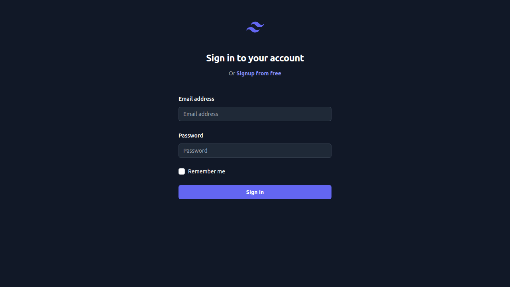
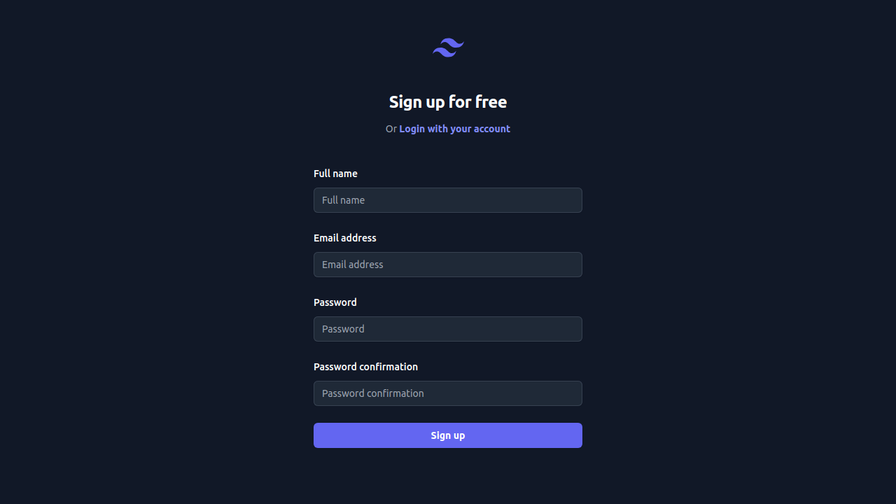
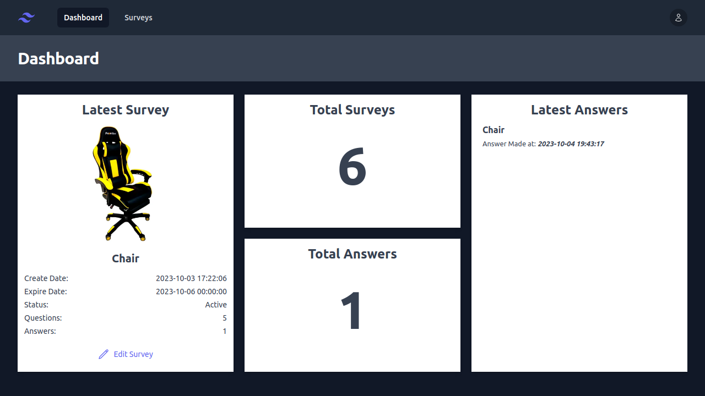
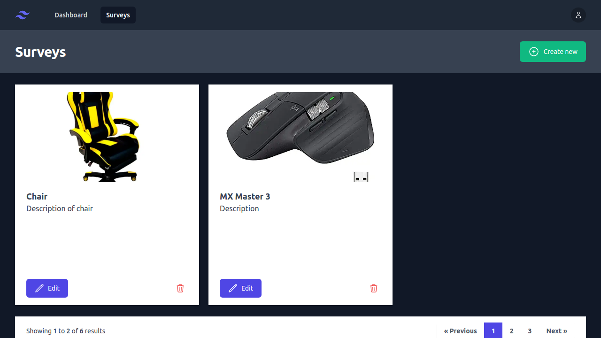
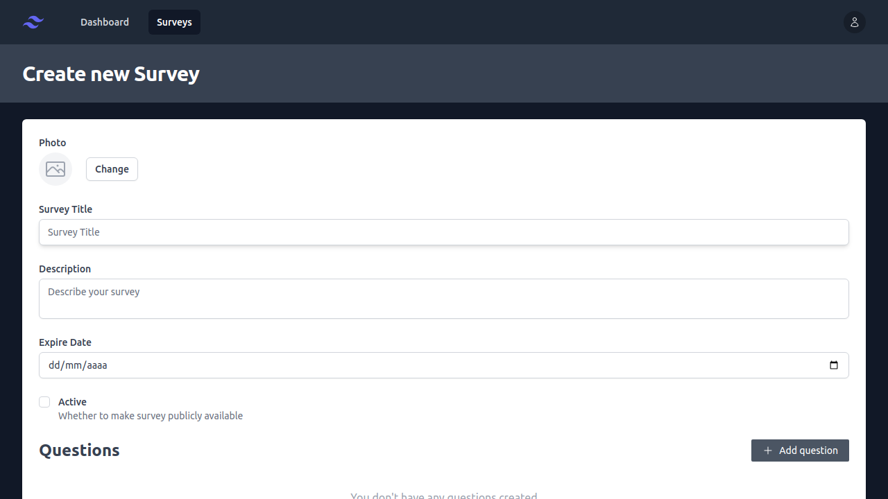
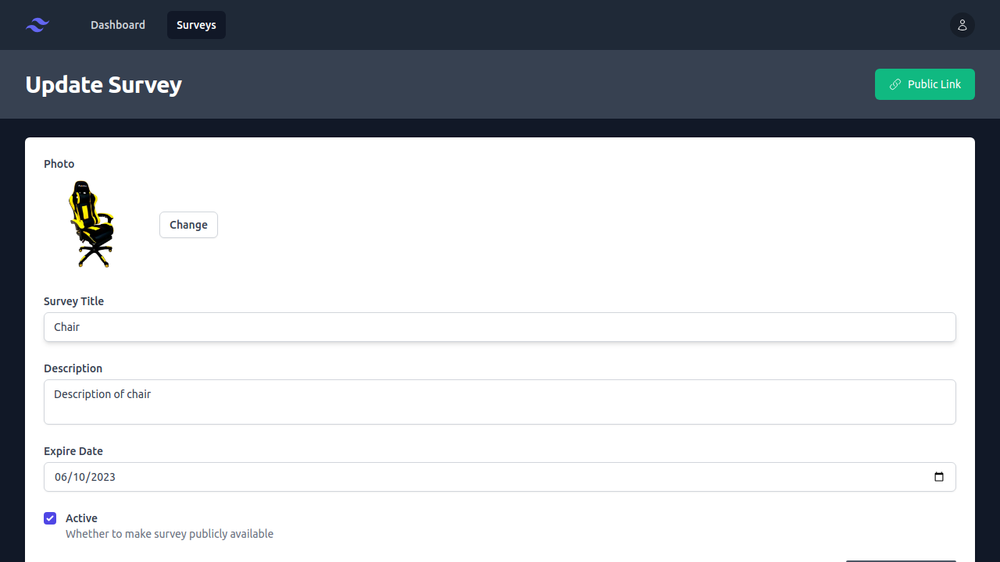
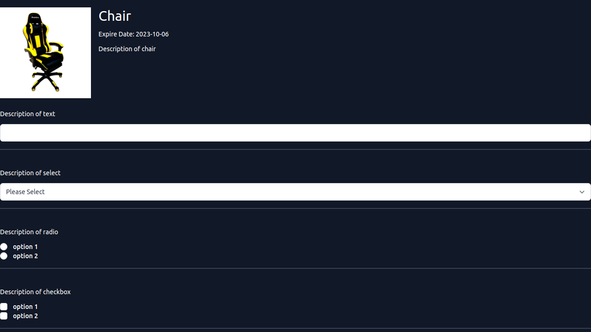
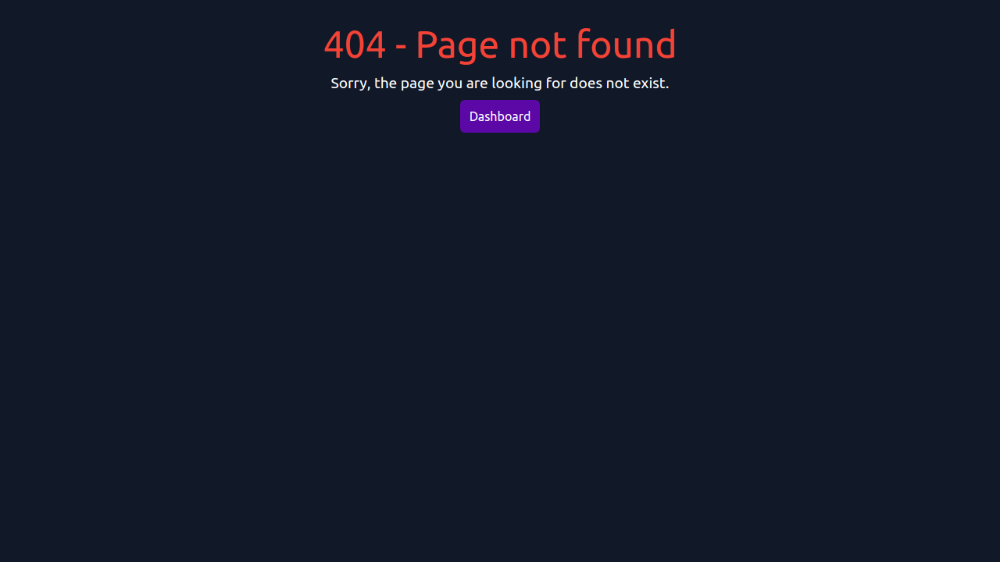

## Vista En Versión Mobile

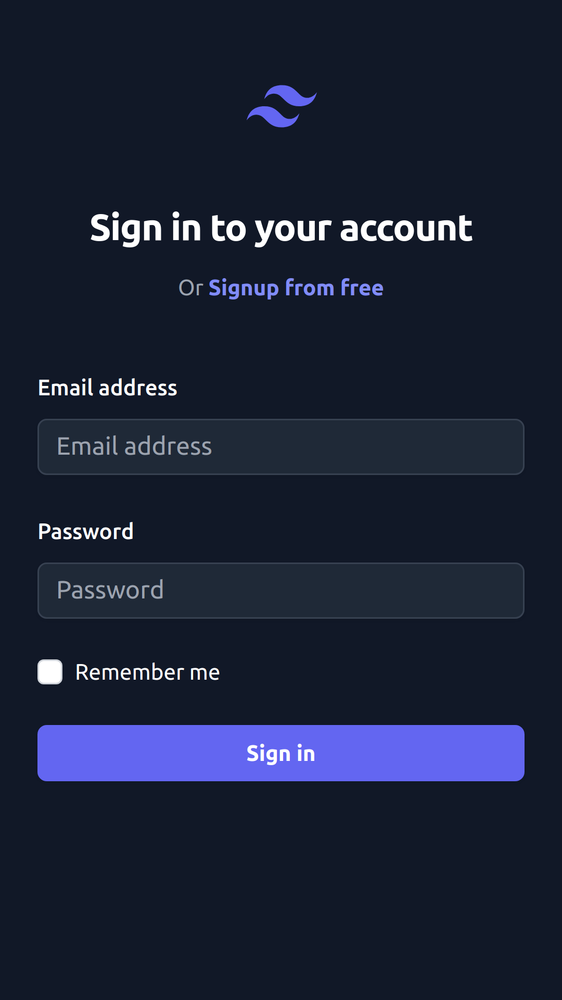
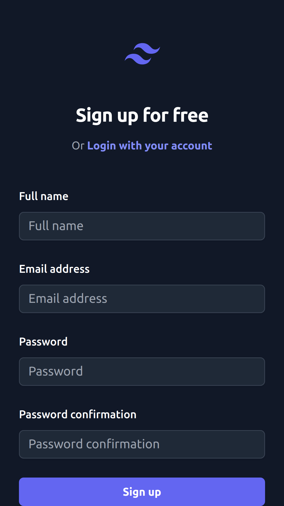
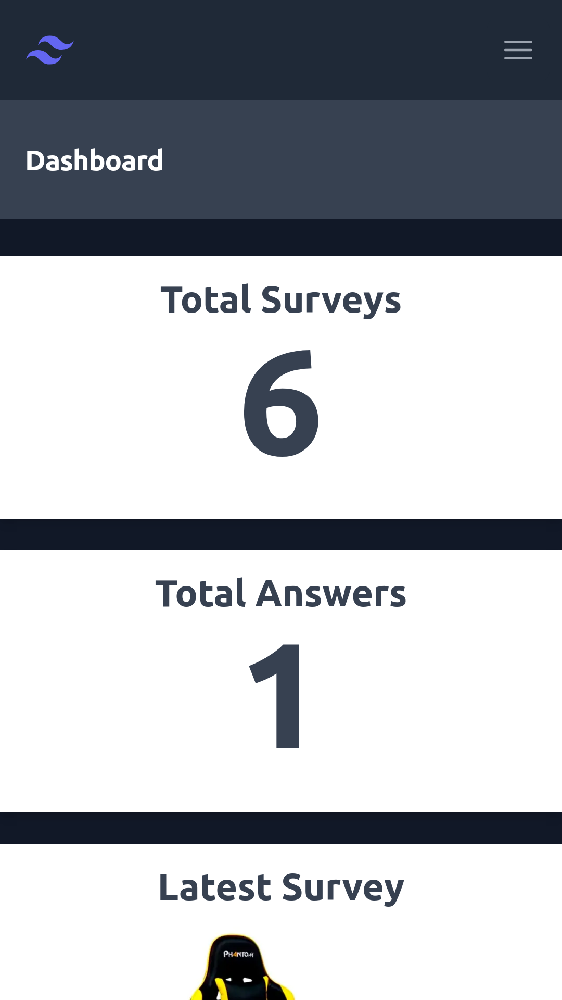

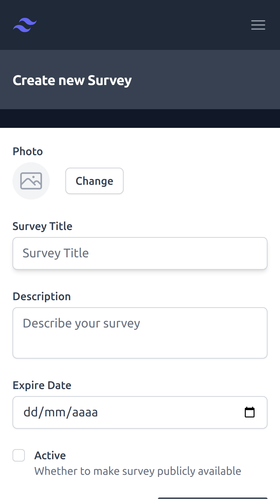
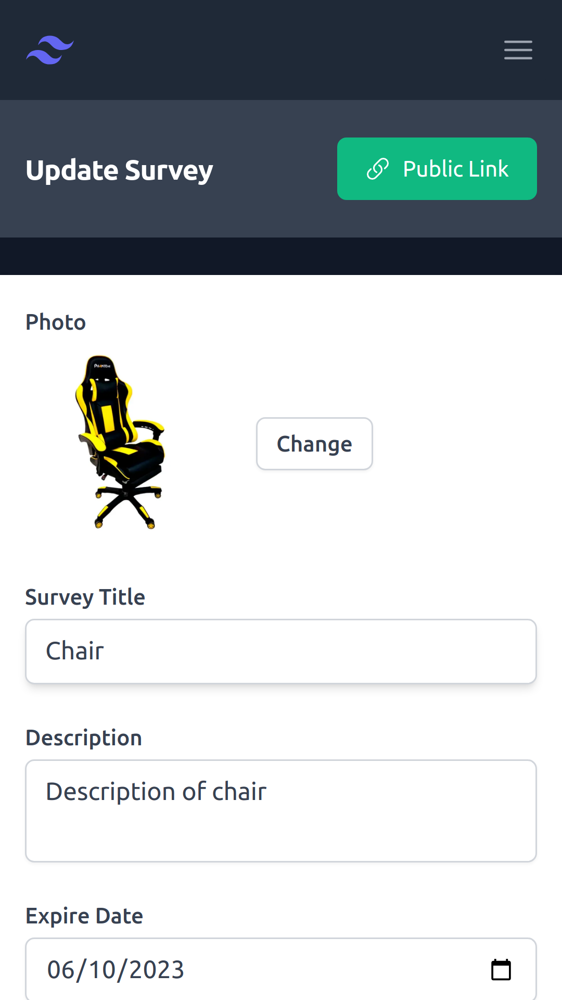
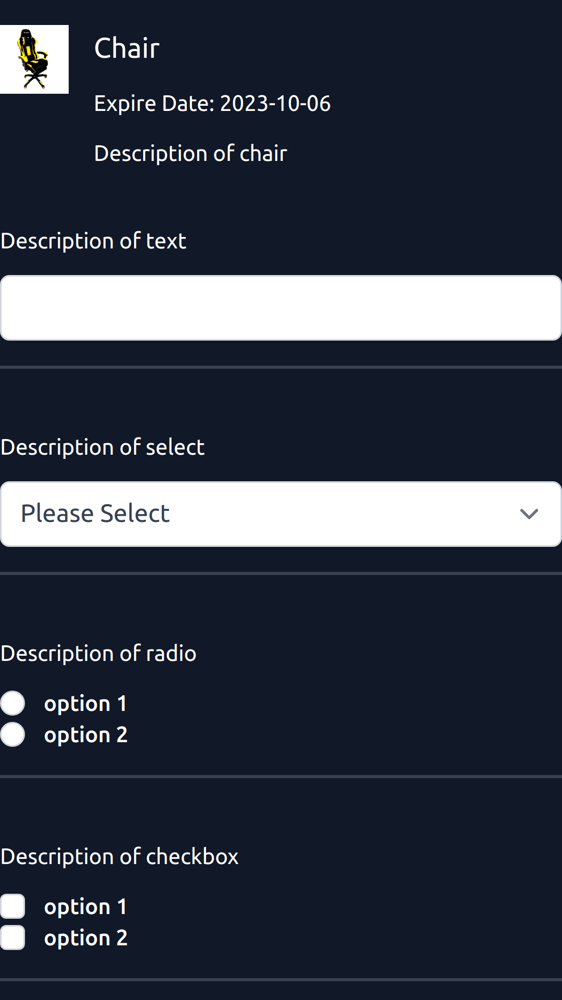

---

## Hecho con

- [React](https://react.dev/) - JS library
- [React router dom](https://reactrouter.com/en/main) - For routes
- [Tailwind CSS](https://tailwindcss.com/) - For styles
- [Tailwinc UI](https://tailwindui.com/) - Tailwind UI components
- [Heroicons](https://heroicons.com/) - For icons
- [Headless UI](https://headlessui.com/) - For UI components
- [Sweetalert2](https://sweetalert2.github.io/) - For alerts
- [Laravel](https://laravel.com/) - PHP Framework

---

## Comandos

- npm i
- npm run dev
- npm run build

---

## Dependencias

- @headlessui/react
- @heroicons/react
- @tailwindcss/forms
- Axios
- React
- React router dom
- Sweetalert2
- uuid

## Dependencias De Desarrollo

- Autoprefixer
- Eslint
- Postcss
- Sweetalert2
- Tailwind
- Vite

---

## Autor

- Website - [Axe10rellana](https://axe10rellana.netlify.app/)
